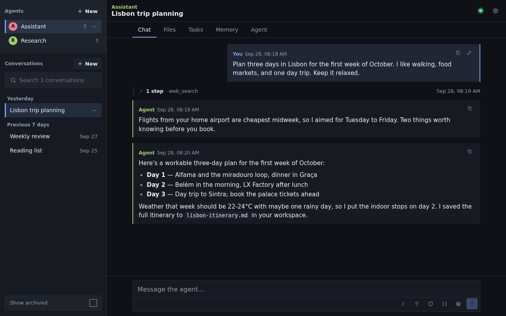
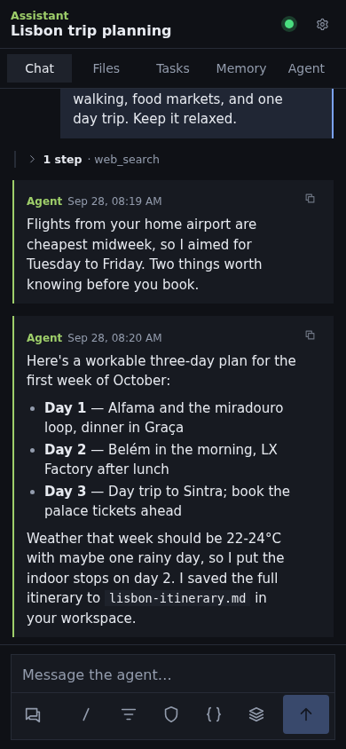
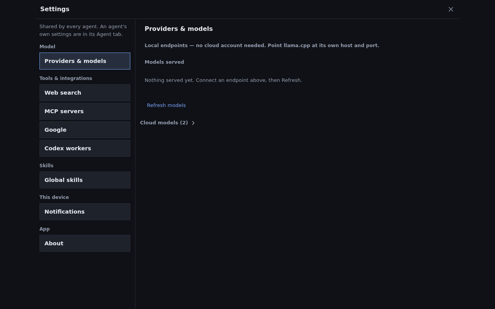
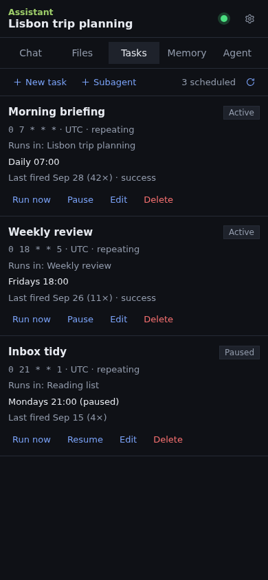

# Letta Code UI

A self-hosted personal AI assistant you can actually live in. Agents keep real
memory, run scheduled tasks, use your tools, and work from a phone — with your
model running on your own machine and nothing leaving it.

This repo is the web app: a mobile-first progressive web app plus the backend
that drives a [Letta](https://www.letta.com/) agent server. There is no Letta
Cloud and no cloud LLM provider in the loop.



## What it does

- **Real memory.** Each agent has a persistent memory store with version
  history, so it remembers you across conversations and you can see exactly
  what it changed and when.
- **Works from your phone.** Install it to the home screen as a PWA. Closing
  the tab does not stop a running turn — the agent keeps going and a push
  notification tells you when it is done.
- **Scheduled tasks.** Cron-style jobs ("brief me every morning at 7") that
  fire into a conversation whether you are watching or not.
- **Your tools, not a sandbox of pretend ones.** Web search and page reading,
  Gmail / Calendar / Tasks through your own OAuth grant, GitHub pull-request
  watching, and any MCP server you add.
- **Files and workspaces.** Every agent works in a real directory you can see
  on the host, with a file browser and inline previews.
- **Subagents and Codex workers.** Fan work out to a parallel agent, or hand a
  job to a Codex CLI worker and watch its run.
- **Skills.** Reusable instructions for agents, at global, agent and project
  scope.
- **Telegram.** Optional: talk to your agents from a chat app.

## Requirements

A host with **`git`** and **`docker`**. That is the whole list — no Node, no
Bun, no pre-built images, and no second checkout. A local model server
(llama.cpp or anything OpenAI-compatible) needs to be reachable from the
container; see step 4.

## Quickstart

```bash
git clone https://github.com/dmarchevsky/letta-code-ui.git
cd letta-code-ui

cp docker/.env.example docker/.env
# Then edit docker/.env — at minimum:
#   SESSION_SECRET   -> openssl rand -hex 32
#   LETTA_STATE_DIR  -> an absolute path, e.g. /srv/letta
#   PUBLIC_ORIGIN    -> the URL you will actually open

docker compose -f docker/compose.yml up -d --build
```

Open `http://localhost:8090`.

By default the stack runs in **local mode**, which has no authentication —
see the next section before you put it anywhere other than your own machine.

### Point it at a model

The app does not ship a model. With llama.cpp running on the host:

```bash
docker compose -f docker/compose.yml exec app-server letta connect
# choose "llama.cpp (local)", base URL http://host.docker.internal:8080/v1
```

## Two ways to run it

One setting, `COMPOSE_PROFILES`, decides which mode you are in and which
optional containers exist.

| | Local mode (default) | Cloudflared mode |
|---|---|---|
| Reachable from | Your LAN, directly | Only through the Cloudflare Tunnel |
| Sign-in | `DEV_BYPASS_EMAIL` — no credential check | Cloudflare Access (Google login) |
| Cloudflare account | Not needed | Required |
| `cloudflared` container | Never created | Created |
| Good for | Development, a trusted home network | Anything reachable from the internet |

**Local mode authenticates nobody.** Whoever can reach the port *is* the
configured user, and that user's agent has your shell, your files and your
integrations. The app refuses to start with a bypass on a non-loopback origin
unless you also set `DEV_BYPASS_ALLOW_REMOTE=true`, which is the deliberate
"yes, on this trusted network" switch. Never combine a bypass with a public
deployment.

For real remote access, set `COMPOSE_PROFILES=cloudflared` and put Cloudflare
Access in front of it. The walkthrough is in
[`docs/CONFIGURATION.md`](docs/CONFIGURATION.md).

## Where your data lives

Everything durable is under one directory, `LETTA_STATE_DIR`, and you can back
the whole install up by copying it.

```
$LETTA_STATE_DIR/
  letta-home/     settings, global skills, CLI logins
  letta-data/     conversations and agent memory
  workspaces/     the directories agents work in
```

Back that one directory up and you have everything.

## Documentation

- [`docs/CONFIGURATION.md`](docs/CONFIGURATION.md) — every environment
  variable, the Compose profiles, deployment walkthroughs (local, Cloudflare
  Tunnel, production), integrations, upgrades, and the security model.

## Screenshots

| Chat on desktop | Chat on a phone |
|---|---|
|  |  |

| Settings | Scheduled tasks |
|---|---|
|  |  |

These are generated from synthetic fixtures, not a live install:

```bash
bun run build && bun run screenshots
```

## Development

Requires [Bun](https://bun.sh).

```bash
bun install
bun run dev          # Vite + BFF
bun run verify       # lint, typecheck, tests, build
```

`CLAUDE.md` is the internal engineering guide — architecture, the invariants
that must not be broken, and how the pieces talk to each other.
